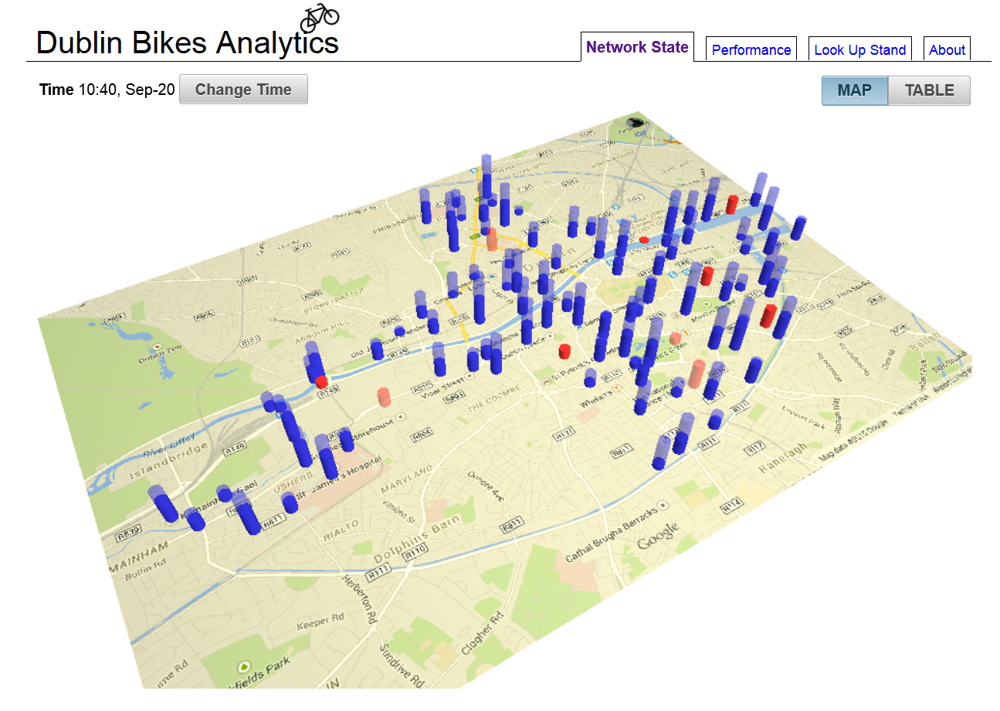

# Dublin Bikes Statistics
A work in progress - plotting the current and historical state of stands in the Dublin Bikes network. The GUI is getting there, and data is fetched from Java. Upcoming work consists of, at a minimum, periodically polling the JC Deceaux API to get real-time data.

